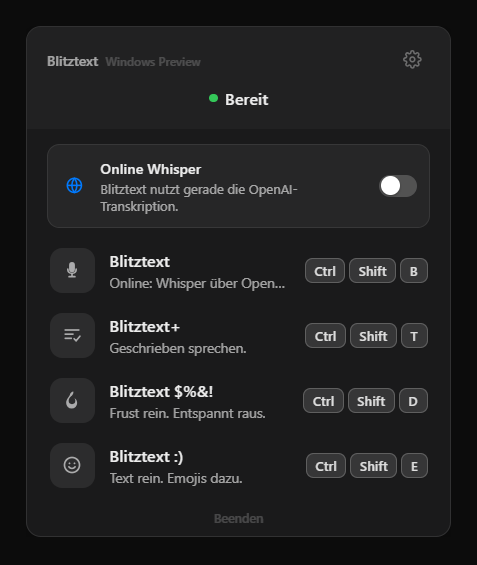
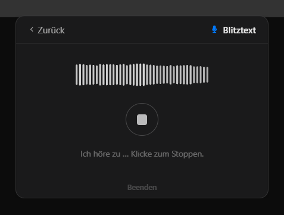
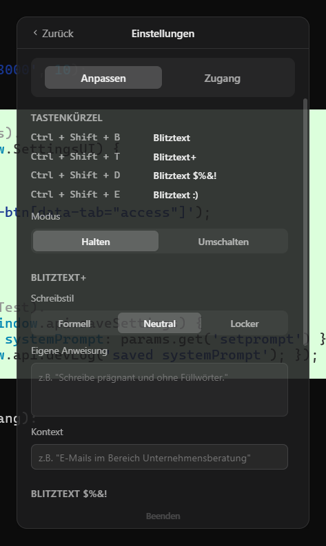

# Blitztext für Windows

Eine **Windows-Portierung** der macOS-Menüleisten-App [**Blitztext**](https://github.com/cmagnussen/blitztext-app) von Christoph Magnussen — Sprache rein, Text raus, direkt an der Cursorposition eingefügt.

Blitztext sitzt als kleines Symbol im Infobereich (Tray). Du startest einen Workflow per Klick oder Tastenkürzel, sprichst, und der transkribierte (und optional von GPT verbesserte) Text wird automatisch in deine zuletzt aktive App eingefügt.

> Dies ist ein eigenständiger, von der Community gebauter Windows-Port. Das Original und das Design stammen von Christoph Magnussen und den Blitztext-Contributors. Beide Projekte stehen unter der MIT-Lizenz.

---

## Screenshots

| Hauptmenü | Aufnahme | Einstellungen |
|---|---|---|
|  |  |  |

---

## Die vier Workflows

| Workflow | Tastenkürzel | Was es macht |
|---|---|---|
| 🎙 **Blitztext** | `Ctrl + Shift + B` | Sprache → Text (Whisper-Transkription) |
| 💬 **Blitztext+** | `Ctrl + Shift + T` | Transkript wird sprachlich verbessert (GPT) |
| 🔥 **Blitztext $%&!** | `Ctrl + Shift + D` | Frust rein → ruhige, sachliche Nachricht raus (GPT) |
| 😊 **Blitztext :)** | `Ctrl + Shift + E` | Text mit passenden Emojis (GPT) |

Jeder Workflow läuft als Zustandsmaschine: *Aufnahme → Transkription → (Verbesserung) → eingefügt*.

---

## Features

- **System-Tray-App** mit transparentem Popover-Fenster (Glassmorphism), schließt bei Fokusverlust
- **Live-Waveform** während der Aufnahme (eigenes Canvas)
- **Globale Hotkeys** für alle vier Workflows (Halten- oder Umschalten-Modus)
- **Auto-Paste**: Text landet automatisch an der Cursorposition deiner vorherigen App
- **Transkription** über OpenAI Whisper (`whisper-1`)
- **GPT-Verbesserung** mit pro Workflow konfigurierbarem Ton, Prompt, Kontext, Emoji-Dichte und Eigennamen
- **API-Key verschlüsselt** lokal gespeichert (electron-store) — nie im Code, nie im Repo
- **Autostart** beim Windows-Login (optional)

---

## Voraussetzungen

- Windows 10/11
- [Node.js](https://nodejs.org/) 20+ (für Entwicklung/Build)
- Ein eigener [OpenAI API Key](https://platform.openai.com/api-keys)
- Ein Mikrofon

---

## Schnellstart (aus dem Quellcode)

```bash
npm install
npm start
```

Beim ersten Start: **Zahnrad → Zugang → OpenAI API Key** eintragen. Danach Tray-Symbol anklicken (oder Hotkey drücken), sprechen, fertig.

Der Key bleibt lokal in `%APPDATA%\Blitztext` (verschlüsselt). Audio und Text werden ausschließlich direkt an die OpenAI-API gesendet.

---

## Build (Windows)

Eine portable App erzeugen:

```bash
npm run build:dir   # oder: npm run build  (NSIS-Installer)
```

> **Hinweis:** Der NSIS-Installer (`electron-builder`) benötigt aktivierten **Windows-Entwicklermodus** oder Admin-Rechte, weil beim Vorbereiten der Signing-Tools macOS-Symlinks entpackt werden. Alternativ erzeugt das mitgelieferte Staging-Verfahren mit `@electron/packager` zuverlässig eine portable `.exe` (siehe `docs/`).

---

## Projektstruktur

```
blitztext-windows/
├── main.js              # Electron Main: Tray, Fenster, Hotkeys, IPC, OpenAI-Calls, Auto-Paste
├── preload.js           # sichere IPC-Bridge
├── renderer/            # UI (HTML/CSS/Vanilla JS)
│   ├── index.html
│   ├── style.css        # komplettes Design-System (Light/Dark)
│   ├── renderer.js      # Seiten, Workflow-Zustandsmaschine
│   ├── waveform.js      # Canvas-Waveform
│   ├── recorder.js      # getUserMedia + MediaRecorder + Pegelmessung
│   ├── settings.js      # Einstellungen
│   └── icons.js         # SVG-Icons
├── services/            # Main-Process-Logik
│   ├── openai.js        # Whisper + GPT
│   ├── prompts.js       # System-Prompts
│   ├── quality.js       # Aufnahme-/Artefakt-Prüfung
│   └── storage.js       # electron-store (Key + Settings)
├── scripts/
│   └── win-input.ps1    # Win32-Helfer: Fokus erfassen + Strg+V
└── assets/              # Icons
```

---

## Tech-Stack

Electron 31 · Vanilla HTML/CSS/JS · Web Audio API + MediaRecorder · electron-store · OpenAI Whisper & Chat Completions. Strg+V wird über `WScript.Shell` simuliert (kein nativer Build nötig).

---

## Danksagung

Original-App, Idee und Design: **[Christoph Magnussen / blitztext-app](https://github.com/cmagnussen/blitztext-app)**. Dieser Port versucht, Funktion und Design des Originals so treu wie möglich auf Windows zu übertragen.

## Lizenz

[MIT](LICENSE) — wie das Original.
